# SmartCourse - Entity Relationship Diagram

```mermaid
erDiagram
    %% ━━━━━━━━━━━━━━━━━━━━━━━━━━━━━━━━━
    %% PG: User Service
    %% ━━━━━━━━━━━━━━━━━━━━━━━━━━━━━━━━━

    users {
        uuid id PK
        varchar email UK
        varchar first_name
        varchar last_name
        varchar password_hash
        varchar role
        boolean is_active
        boolean is_verified
        varchar phone_number
        timestamp created_at
        timestamp updated_at
    }

    student_profiles {
        uuid id PK
        uuid user_id FK,UK
        text bio
        varchar education_level
        varchar profile_picture_url
        int total_enrollments
        int total_completed
        timestamp created_at
        timestamp updated_at
    }

    instructor_profiles {
        uuid id PK
        uuid user_id FK,UK
        text bio
        varchar profile_picture_url
        varchar phone_number
        int total_students
        int total_courses
        float average_rating
        boolean is_verified_instructor
        timestamp verification_date
        timestamp created_at
        timestamp updated_at
    }

    %% ━━━━━━━━━━━━━━━━━━━━━━━━━━━━━━━━━
    %% PG: Course Service
    %% ━━━━━━━━━━━━━━━━━━━━━━━━━━━━━━━━━

    courses {
        uuid id PK
        varchar title
        varchar slug UK
        text description
        text long_description
        uuid instructor_id
        varchar category
        varchar level
        varchar language
        decimal duration_hours
        decimal price
        varchar currency
        varchar thumbnail_url
        varchar status
        timestamp published_at
        int max_students
        text prerequisites
        text learning_objectives
        boolean is_deleted
        timestamp created_at
        timestamp updated_at
    }

    enrollments {
        uuid id PK
        uuid student_id
        uuid course_id FK
        varchar status
        timestamp enrolled_at
        timestamp started_at
        timestamp completed_at
        timestamp dropped_at
        timestamp last_accessed_at
        varchar payment_status
        decimal payment_amount
        varchar enrollment_source
        timestamp created_at
        timestamp updated_at
    }

    progress {
        uuid id PK
        uuid enrollment_id FK
        varchar item_type
        varchar item_id
        decimal progress_percentage
        timestamp completed_at
        timestamp created_at
        timestamp updated_at
    }

    certificates {
        uuid id PK
        uuid enrollment_id FK,UK
        varchar certificate_number UK
        date issue_date
        varchar certificate_url
        varchar verification_code UK
        varchar grade
        decimal score_percentage
        uuid issued_by_id
        boolean is_revoked
        timestamp revoked_at
        text revoked_reason
        timestamp created_at
    }

    quiz_attempts {
        uuid id PK
        uuid enrollment_id FK
        varchar module_id
        int attempt_number
        varchar status
        decimal score
        boolean passed
        int time_spent_seconds
        int quiz_version
        timestamp started_at
        timestamp submitted_at
        timestamp graded_at
        timestamp created_at
        timestamp updated_at
    }

    user_answers {
        uuid id PK
        uuid quiz_attempt_id FK
        varchar question_id
        varchar question_type
        jsonb user_response
        boolean is_correct
        int time_spent_seconds
        timestamp answered_at
        timestamp created_at
        timestamp updated_at
    }

    %% ━━━━━━━━━━━━━━━━━━━━━━━━━━━━━━━━━
    %% MongoDB Collections
    %% ━━━━━━━━━━━━━━━━━━━━━━━━━━━━━━━━━

    course_content {
        objectid _id PK
        uuid course_id UK
        array modules
        object metadata
        timestamp created_at
        timestamp updated_at
    }

    modules_embedded {
        string module_id PK
        string title
        string description
        int order
        boolean is_published
        boolean is_active
        array lessons
    }

    lessons_embedded {
        string lesson_id PK
        string title
        string type
        string content
        int duration_minutes
        int order
        boolean is_preview
        boolean is_active
        array resources
    }

    resources_embedded {
        string resource_id PK
        string name
        string url
        string type
        boolean is_active
    }

    module_quizzes {
        objectid _id PK
        uuid course_id
        string module_id UK
        string title
        string description
        object settings
        array questions
        object authorship
        boolean is_published
        boolean is_active
        timestamp created_at
        timestamp updated_at
    }

    quiz_questions_embedded {
        string question_id PK
        int order
        string question_text
        string question_type
        array options
        array correct_answers
        boolean case_sensitive
        string explanation
        string hint
    }

    module_summaries {
        objectid _id PK
        uuid course_id
        string module_id UK
        string title
        object content
        object authorship
        boolean is_published
        boolean is_active
        timestamp created_at
        timestamp updated_at
    }

    summary_content_embedded {
        string summary_text
        string summary_html
        array key_points
        array learning_objectives
        array glossary
        object difficulty_assessment
    }

    %% ━━━━━━━━━━━━━━━━━━━━━━━━━━━━━━━━━
    %% Qdrant Vector DB
    %% ━━━━━━━━━━━━━━━━━━━━━━━━━━━━━━━━━

    course_embeddings {
        uuid id PK
        vector embedding
        string course_id
        string module_id
        string lesson_id
        int chunk_index
        string text
        string lesson_title
        string module_title
        string preview
    }

    %% ═══════════════════════════════════
    %% RELATIONSHIPS
    %% ═══════════════════════════════════

    %% User Service - DB FKs
    users ||--o| student_profiles : "1:1 has student profile"
    users ||--o| instructor_profiles : "1:1 has instructor profile"

    %% Instructor → Courses (cross-service logical)
    instructor_profiles ||--o{ courses : "1:N creates courses"

    %% Student → Enrollments (cross-service logical)
    student_profiles ||--o{ enrollments : "1:N enrolls in"

    %% Course Service - DB FKs
    courses ||--o{ enrollments : "1:N has enrollments"
    enrollments ||--o{ progress : "1:N tracks progress"
    enrollments ||--o| certificates : "1:1 earns certificate"
    enrollments ||--o{ quiz_attempts : "1:N has attempts"
    quiz_attempts ||--o{ user_answers : "1:N contains answers"

    %% PG → MongoDB (cross-store logical)
    courses ||--|| course_content : "1:1 has content"
    courses ||--o{ module_quizzes : "1:N has quizzes"
    courses ||--o{ module_summaries : "1:N has summaries"

    %% MongoDB Embedded Documents
    course_content ||--o{ modules_embedded : "contains modules"
    modules_embedded ||--o{ lessons_embedded : "contains lessons"
    lessons_embedded ||--o{ resources_embedded : "contains resources"
    module_quizzes ||--o{ quiz_questions_embedded : "contains questions"
    module_summaries ||--|| summary_content_embedded : "contains summary"

    %% PG → Qdrant (cross-store)
    courses ||--o{ course_embeddings : "1:N chunked embeddings"
```

---

## Relationship Types

| From                | To                  | Cardinality | Type        | FK Column                                                       |
| ------------------- | ------------------- | ----------- | ----------- | --------------------------------------------------------------- |
| users               | student_profiles    | 1:1         | DB FK       | student_profiles.user_id → users.id (CASCADE, UNIQUE)           |
| users               | instructor_profiles | 1:1         | DB FK       | instructor_profiles.user_id → users.id (CASCADE, UNIQUE)        |
| instructor_profiles | courses             | 1:N         | logical     | courses.instructor_id → users.id (cross-service, no FK)         |
| student_profiles    | enrollments         | 1:N         | logical     | enrollments.student_id → users.id (cross-service, no FK)        |
| courses             | enrollments         | 1:N         | DB FK       | enrollments.course_id → courses.id                              |
| enrollments         | progress            | 1:N         | DB FK       | progress.enrollment_id → enrollments.id (CASCADE)               |
| enrollments         | certificates        | 1:1         | DB FK       | certificates.enrollment_id → enrollments.id (CASCADE, UNIQUE)   |
| enrollments         | quiz_attempts       | 1:N         | DB FK       | quiz_attempts.enrollment_id → enrollments.id (CASCADE)          |
| quiz_attempts       | user_answers        | 1:N         | DB FK       | user_answers.quiz_attempt_id → quiz_attempts.id (CASCADE)       |
| courses             | course_content      | 1:1         | cross-store | course_content.course_id → courses.id (unique index in MongoDB) |
| courses             | module_quizzes      | 1:N         | cross-store | module_quizzes.course_id → courses.id                           |
| courses             | module_summaries    | 1:N         | cross-store | module_summaries.course_id → courses.id                         |
| course_content      | modules_embedded    | 1:N         | embedded    | Embedded in course_content.modules array                         |
| modules_embedded    | lessons_embedded    | 1:N         | embedded    | Embedded in modules.lessons array                                |
| lessons_embedded    | resources_embedded  | 1:N         | embedded    | Embedded in lessons.resources array                              |
| module_quizzes      | quiz_questions_embedded | 1:N     | embedded    | Embedded in module_quizzes.questions array                       |
| module_summaries    | summary_content_embedded | 1:1     | embedded    | Embedded in module_summaries.content object                      |
| courses             | course_embeddings   | 1:N         | cross-store | course_embeddings.course_id → courses.id (Qdrant payload filter) |

---

## Unique Constraints

| Table            | Columns                                                    |
| ---------------- | ---------------------------------------------------------- |
| users            | (email)                                                    |
| courses          | (slug)                                                     |
| enrollments      | (student_id, course_id)                                    |
| progress         | (enrollment_id, item_type, item_id)                        |
| certificates     | (enrollment_id), (certificate_number), (verification_code) |
| quiz_attempts    | (enrollment_id, module_id, attempt_number)                 |
| module_quizzes   | (course_id, module_id)                                     |
| module_summaries | (course_id, module_id)                                     |

---

## Database Distribution

| Store          | Service             | Entities                                                                  |
| -------------- | ------------------- | ------------------------------------------------------------------------- |
| **PostgreSQL** | User Service        | users, student_profiles, instructor_profiles                              |
| **PostgreSQL** | Course Service      | courses, enrollments, progress, certificates, quiz_attempts, user_answers |
| **MongoDB**    | Course + AI Service | course_content, module_quizzes, module_summaries                          |
| **Qdrant**     | AI Service          | course_embeddings (1536-dim, text-embedding-3-small, cosine)              |
| **Redis**      | AI Service          | generation status cache (TTL: 1hr)                                        |
