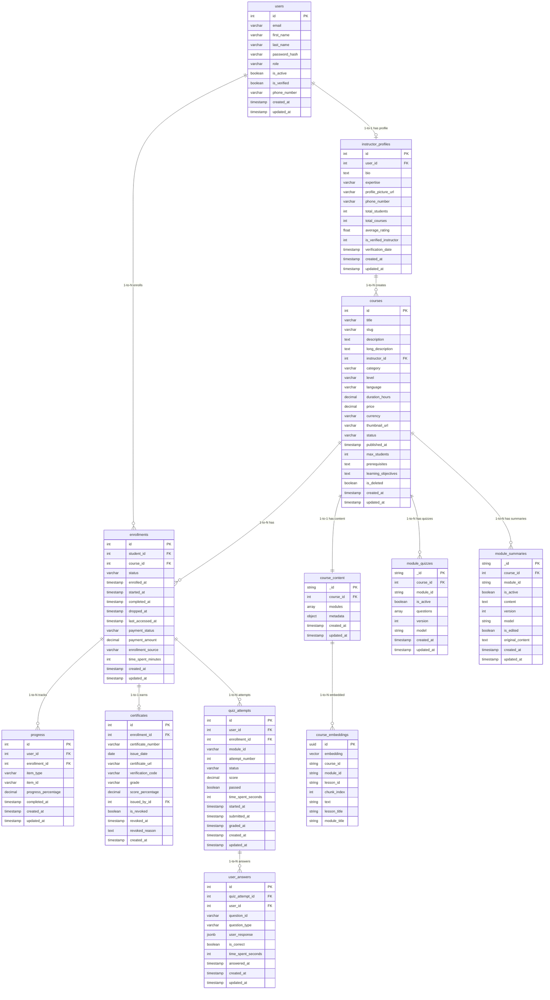

# SmartCourse - Entity Relationship Diagram

---

## Relationship Types

| From | To | Cardinality | Type | FK Column |
|---|---|---|---|---|
| users | instructor_profiles | 1:1 | DB FK | instructor_profiles.user_id → users.id (CASCADE, UNIQUE) |
| instructor_profiles | courses | 1:N | logical | courses.instructor_id → instructor_profiles.id (cross-service) |
| users | enrollments | 1:N | logical | enrollments.student_id → users.id (cross-service) |
| courses | enrollments | 1:N | logical | enrollments.course_id → courses.id |
| enrollments | progress | 1:N | DB FK | progress.enrollment_id → enrollments.id (CASCADE) |
| enrollments | certificates | 1:1 | DB FK | certificates.enrollment_id → enrollments.id (CASCADE, UNIQUE) |
| enrollments | quiz_attempts | 1:N | DB FK | quiz_attempts.enrollment_id → enrollments.id (CASCADE) |
| quiz_attempts | user_answers | 1:N | DB FK | user_answers.quiz_attempt_id → quiz_attempts.id (CASCADE) |
| courses | course_content | 1:1 | cross-store | course_content.course_id → courses.id (unique index) |
| courses | module_quizzes | 1:N | cross-store | module_quizzes.course_id → courses.id |
| courses | module_summaries | 1:N | cross-store | module_summaries.course_id → courses.id |
| course_content | course_embeddings | 1:N | cross-store | Lesson text chunked and embedded into Qdrant |

---

## Database Distribution

| Store | Entities |
|---|---|
| **PostgreSQL (User Service)** | users, instructor_profiles |
| **PostgreSQL (Course Service)** | courses, enrollments, progress, certificates, quiz_attempts, user_answers |
| **MongoDB** | course_content, module_quizzes, module_summaries |
| **Qdrant** | course_embeddings |
